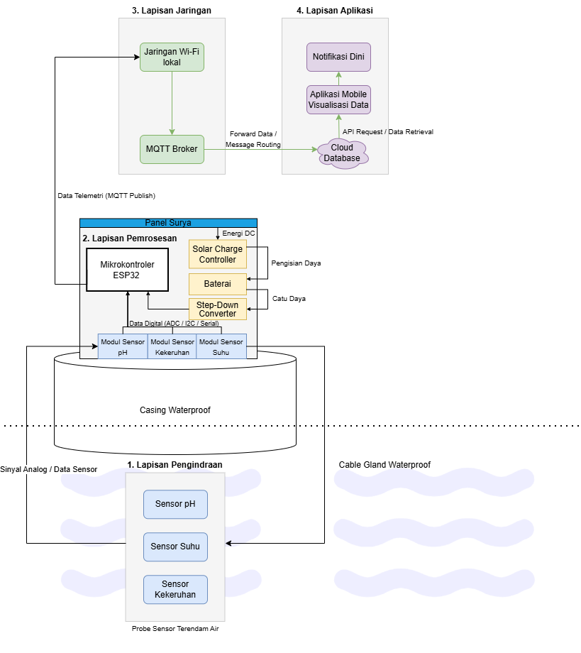

<div align="center">
  <h1>Smart Buoy IoT System 🌊</h1>
  <h3>Platform Pemantauan Akuakultur Otonom</h3>
  
  [](#)
  [](#)
  [](#)
  [](#)
  [](#)

  <br />
  <br />
  
</div>

---

## 📖 Ringkasan Eksekutif
**Smart Buoy IoT System** adalah solusi pemantauan perairan otonom yang tangguh, dirancang khusus untuk industri akuakultur komersial (tambak udang dan ikan). Dengan memanfaatkan telemetri *real-time* dan aliran data NoSQL yang sangat optimal, sistem ini memberikan visibilitas instan kepada operator tambak mengenai parameter kualitas air yang krusial, yang secara signifikan dapat menekan tingkat kematian (*mortality rate*) dan mengoptimalkan hasil panen.

## ✨ Fitur Unggulan
- **Telemetri Berkelanjutan:** Pemantauan otonom 24/7 untuk parameter **Suhu**, **pH**, dan **Kekeruhan Air (Turbidity)**.
- **Protokol Hemat Bandwidth:** Mengimplementasikan transmisi cerdas berbasis *Threshold* (Ambang Batas) yang mampu memangkas beban data hingga 80%, sangat ideal untuk lingkungan jaringan seluler berkecepatan rendah (seperti modul SIM800L).
- **Sistem Daya Redundan:** Dirancang untuk operasi jangka panjang (*sustainable deployment*) menggunakan kombinasi baterai internal Li-Ion dan panel surya atap.
- **Arsitektur Data Skala Industri:** Terintegrasi penuh dengan Firebase Realtime Database menggunakan dua jalur pipa data (*data pipelines*) terpisah untuk visualisasi *real-time* dan pencatatan riwayat historis.

---

## 🏗️ Arsitektur Sistem

### Alur Telemetri
*Firmware* dirancang secara agresif untuk meminimalkan beban kerja mikrokontroler (MCU) dan ukuran *payload* jaringan. Data didistribusikan secara eksklusif ke **Firebase Realtime Database** melalui dua jalur logis:

```text
[ Node Smart Buoy (ESP32) ]
    │
    ├──→ /smart_buoy/live/      [ Aliran Real-Time ]
    │                             ▸ Pemicu: Pergeseran Nilai (Suhu>0.1, pH>0.05, Kekeruhan>5)
    │                             ▸ Target: Sinkronisasi instan pada dashboard aplikasi mobile
    │
    └──→ /smart_buoy/history/   [ Time-Series Data Lake ]
                                  ▸ Pemicu: Interval Waktu Cron (Tiap 10 Menit)
                                  ▸ Target: Analisis tren historis dan pembuatan grafik
```

### Spesifikasi *Payload* Data
Demi memastikan komunikasi mesin-ke-mesin (M2M) yang ultra-ringan, pemrosesan teks dan logika kualitatif dialihkan sepenuhnya ke sisi aplikasi (*client-side*).

**1. Node Live (`/smart_buoy/live/`)**
| Kunci (Key) | Tipe Data | Deskripsi |
|:---:|:---:|---|
| `temp` | `double` | Suhu Air (°C) |
| `pH` | `double` | Tingkat Keasaman (pH) |
| `turb` | `int` | Nilai Mentah ADC Sensor Kekeruhan |

**2. Node History (`/smart_buoy/history/`)**
| Kunci (Key) | Tipe Data | Deskripsi |
|:---:|:---:|---|
| `temp` | `double` | Suhu Air (°C) |
| `pH` | `double` | Tingkat Keasaman (pH) |
| `turb` | `int` | Nilai Mentah ADC Sensor Kekeruhan |
| `ts` | `int` | Stempel Waktu (Unix Epoch Timestamp) |

> **Catatan Arsitektur:** Teks status kualitatif (misal: "Jernih", "Kotor") dan format waktu jam/tanggal sengaja tidak disertakan dari alat untuk menghemat kuota transmisi. Aplikasi *client* wajib menghitung dan menerjemahkan status ini secara dinamis.

---

## 🛠️ Kebutuhan Perangkat Keras
- **MCU Utama:** DOIT ESP32 DevKit V1
- **Sensor:** Sensor pH Analog, Sensor Suhu Tahan Air DS18B20, Sensor Kekeruhan Analog
- **Modul Daya:** Modul Cas TP4056, Baterai Li-Ion 18650, Panel Surya 5V
- **Konektivitas (Rencana Mendatang):** Modul GSM SIM800L v2

---

## 💻 Panduan Instalasi *Firmware*

### Persyaratan Sistem
- **Arduino IDE 2.x** atau PlatformIO.
- **ESP32 Core** terinstal melalui *Board Manager*.
- Pustaka (Library) yang diwajibkan:
  - `Firebase ESP32 Client` (Oleh Mobizt)
  - `DallasTemperature` (Oleh Miles Burton)
  - `OneWire` (Oleh Paul Stoffregen)

### Langkah Kompilasi
1. **Kloning Repositori:**
   ```bash
   git clone https://github.com/ediiloupatty/buoy.git
   ```
2. **Konfigurasi Lingkungan:**
   Buka file `Config.h` dan masukkan kredensial rahasia Anda:
   ```c
   // Konfigurasi Jaringan Lokal
   static const char *ssid = "NAMA_WIFI_ANDA";
   static const char *password = "PASSWORD_WIFI_ANDA";

   // Konfigurasi Firebase Enterprise
   #define FIREBASE_HOST "id-proyek-anda.region.firebasedatabase.app"
   #define FIREBASE_AUTH "kunci_rahasia_database_anda"
   ```
3. **Kompilasi & Flash:** Pilih papan **DOIT ESP32 DEVKIT V1** dan jalankan urutan unggah (*upload*). Tahan tombol fisik `BOOT` pada ESP32 apabila terminal terhenti pada pesan `Connecting...`.

---

## 📱 Integrasi Aplikasi Mobile (Flutter)

Aplikasi mobile pendamping bertindak sebagai pusat komando operasi (*Operations Center*).

### 1. Inisialisasi Klien
Ikat aplikasi klien ke Firebase menggunakan *FlutterFire CLI*:
```bash
flutterfire configure --project=id-proyek-firebase-anda
flutter pub add firebase_core firebase_database
```

### 2. Penanganan Data Sisi Klien (*Client-Side*)
Untuk mematuhi arsitektur *payload* yang ringan, klien bertanggung jawab penuh atas transformasi dan penghalusan data:

```dart
import 'package:firebase_database/firebase_database.dart';

class LayananKualitasAir {
  final DatabaseReference _liveRef = FirebaseDatabase.instance.ref('smart_buoy/live');

  // Logika Bisnis: Menghitung status kualitatif dari telemetri mentah
  String hitungStatusKekeruhan(int turbMentah) {
    if (turbMentah < 1500) return 'Jernih (Clear)';
    if (turbMentah < 3000) return 'Keruh (Cloudy)';
    return 'Kritis / Kotor (Dirty)';
  }

  // Berlangganan (Subscribe) ke pembaruan telemetri real-time
  void mulaiPantauTelemetri() {
    _liveRef.onValue.listen((event) {
      if (event.snapshot.value == null) return;
      
      final payload = event.snapshot.value as Map<dynamic, dynamic>;
      final double temp = (payload['temp'] ?? 0).toDouble();
      final double ph = (payload['pH'] ?? 0).toDouble();
      final int turb = (payload['turb'] ?? 0).toInt();
      
      final String status = hitungStatusKekeruhan(turb);
      
      print('Update Telemetri -> Suhu: $temp°C | pH: $ph | Status: $status');
    });
  }
}
```

> **🛡️ Security Advisory:** Strictly do not commit configuration files such as `.env`, `google-services.json`, or `GoogleService-Info.plist` to version control. Strict IAM policies and Firebase Rules must be enforced for production deployments.

---
<div align="center">
  <p>© 2026 Smart Buoy Systems. Hak Cipta Dilindungi Undang-Undang.</p>
</div>
